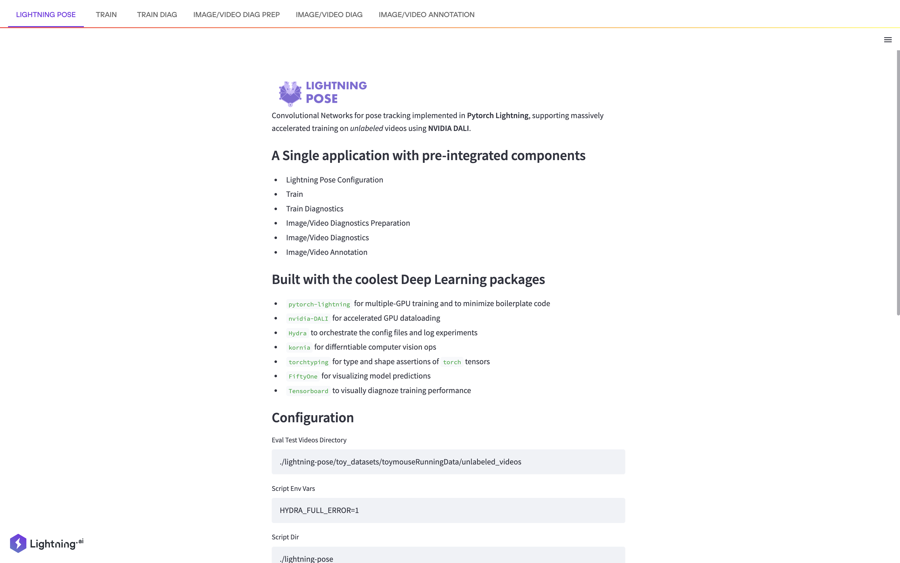
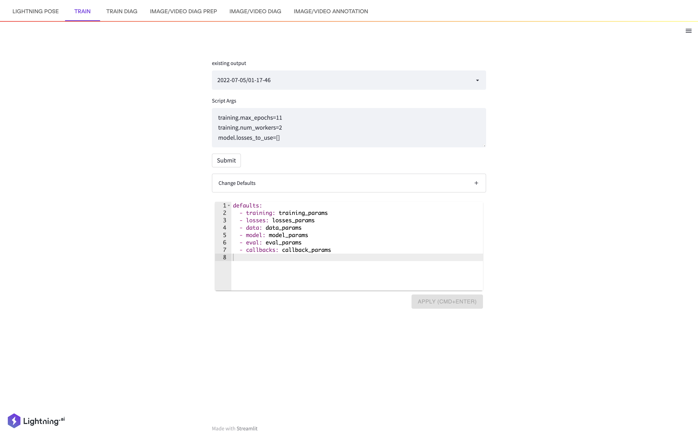
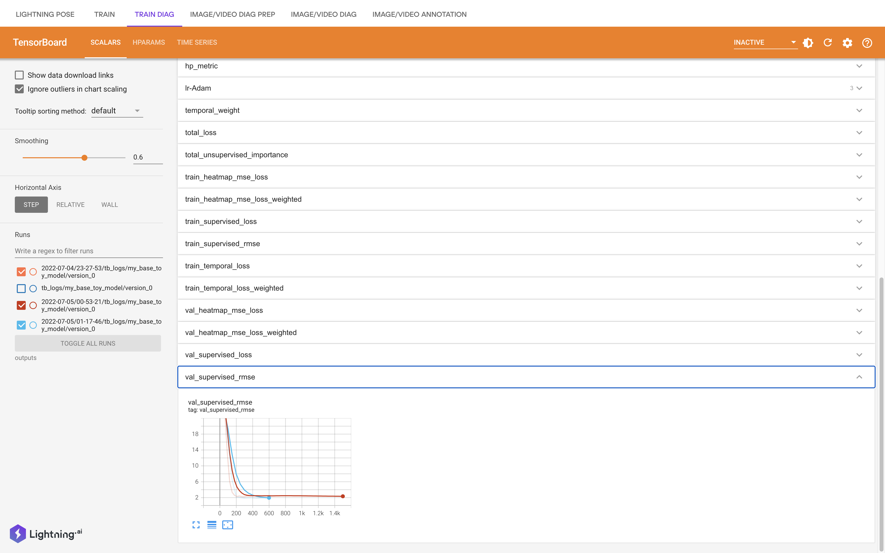
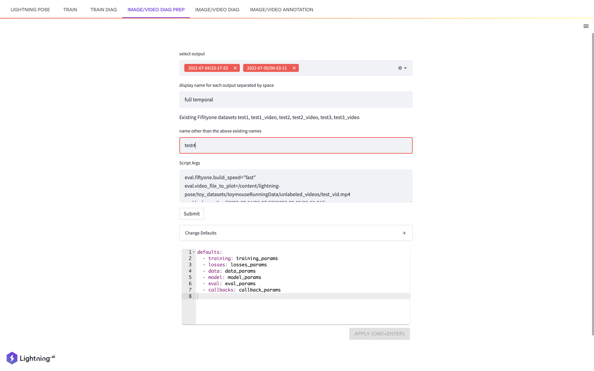
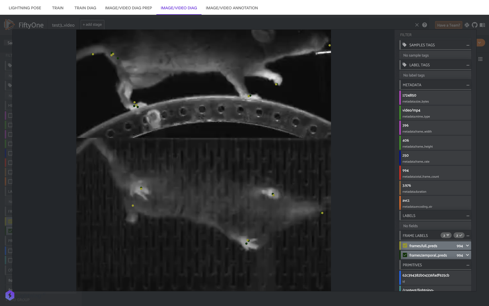
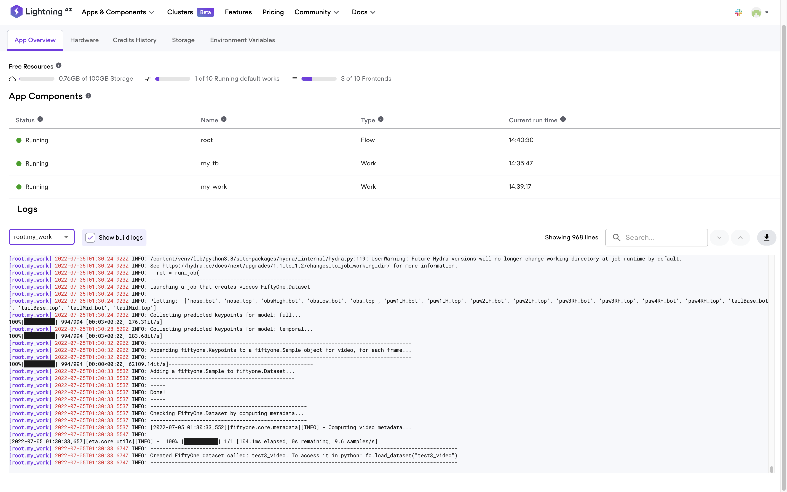
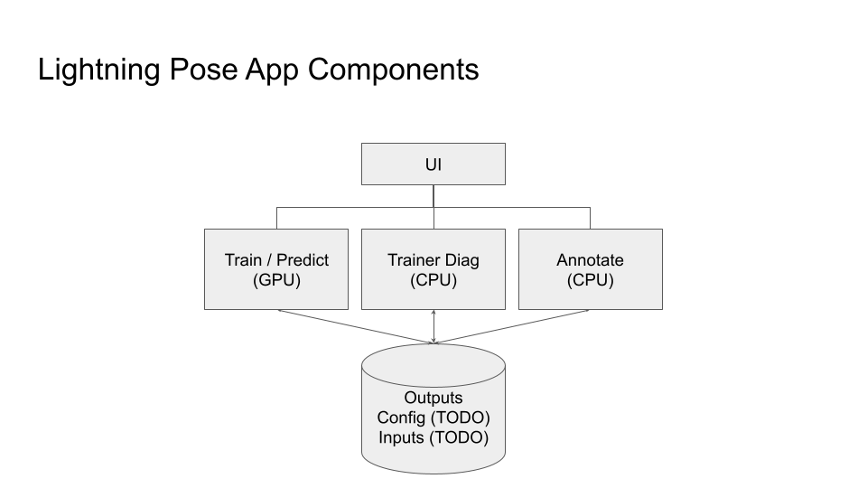
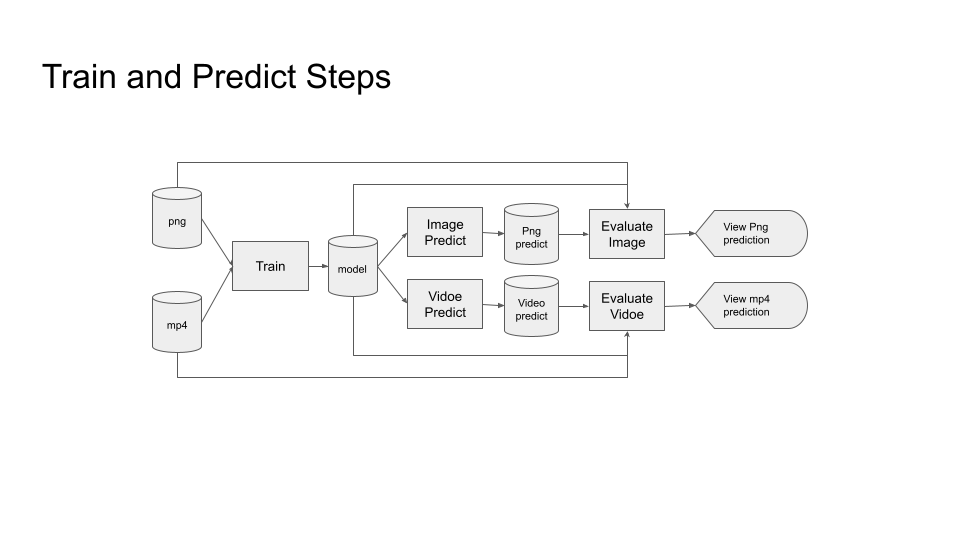

# Lightning Pose App

App for:
* Annotating keypoints on images
* Training a model to predict keypoints (after configuring it)
* Predicting keypoints on images and videos
* Looking at diagnostics via Tensorboard and FiftyOne
* More to come! (Deploying for new videos, active learning, etc.)

## Screenshots
- About Page

- Train UI

- Train Daig

- Predict UI

- Compare PNG Models

- Compare MP4 Models

- LPA Admin / Console UI


## Architecture
- Components

- Train Predict Steps


## Prerequisites

For now, the installation assumes 
- Grid Session GPU instance 
- Microsoft Visual Studio Code on laptop
- local editable installation of `lightning-pose`
- Use `python -m pip`, which is the best practice when using virtual env like `conda`.
- DO NOT USE `pip`.  Some modules may not install correctly.

# From laptop

open a terminal

## create grid session 

```
grid session create --instance_type g4dn.xlarge 
```

make sure session ssh is setup for VSC
```
grid session ssh GRID_SESSION_NAME "exit"
```

open VSC

- From the VSC, connect to GRID_SESSION_NAME

# Inside GRID_SESSION_NAME from VSC

## create conda env inside

- create lai
```bash
cd ~
conda create --yes --name lai python=3.8
conda activate lai
python -m pip install lightning --upgrade
```

- record versions and git hash
```
lightning --version
python --version
```

### Download lightning-pose-app and put lightning-pose inside it

- setup lighting env
```bash
cd ~
git clone https://github.com/PyTorchLightning/lightning-pose-app
cd lightning-pose-app
git checkout rslee-prototype-cloud
python -m pip install -r requirements.txt 
git clone https://github.com/danbider/lightning-pose 
```

- setup local environment to mirror cloud
```bash
virtualenv ~/venv-tensorboard 
source ~/venv-tensorboard/bin/activate; which python; python -m pip install tensorflow tensorboard; deactivate

virtualenv ~/venv-label-studio 
git clone https://github.com/robert-s-lee/label-studio; cd label-studio; git checkout x-frame-options; cd ..
source ~/venv-label-studio/bin/activate; cd label-studio; which python; python -m pip install -e .; cd ..; deactivate

virtualenv ~/venv-lightning-pose
source ~/venv-lightning-pose/bin/activate; cd lightning-pose; which python; python -m pip install -e .; cd ..; deactivate
```
- test tensorboard 
```bash
source ~/venv-tensorboard/bin/activate; tensorboard --logdir .; deactivate
```
- test label-studio
```bash
source ~/venv-label-studio/bin/activate; cd label-studio; python label_studio/manage.py migrate; python label_studio/manage.py runserver; cd ..; deactivate
```
### Locally

In order to run the application locally, run the following commands

```bash
cd lightning-pose-app
lightning run app app.py
```

The following can be resolved with `rm -rf ~/.fiftyone`

```
{"t":{"$date":"2022-05-23T14:42:45.150Z"},"s":"I",  "c":"CONTROL",  "id":20697,   "ctx":"main","msg":"Renamed existing log file","attr":{"oldLogPath":"/Users/robertlee/.fiftyone/var/lib/mongo/log/mongo.log","newLogPath":"/Users/robertlee/.fiftyone/var/lib/mongo/log/mongo.log.2022-05-23T14-42-45"}}
Subprocess ['/opt/miniconda3/envs/lai/lib/python3.8/site-packages/fiftyone/db/bin/mongod', '--dbpath', '/Users/robertlee/.fiftyone/var/lib/mongo', '--logpath', '/Users/robertlee/.fiftyone/var/lib/mongo/log/mongo.log', '--port', '0', '--nounixsocket'] exited with error 100:
```

### On GPU
```
lightning run app app.py --cloud --name lightning-pose --env NVIDIA_DRIVER_CAPABILITIES=compute,utility,video
```
